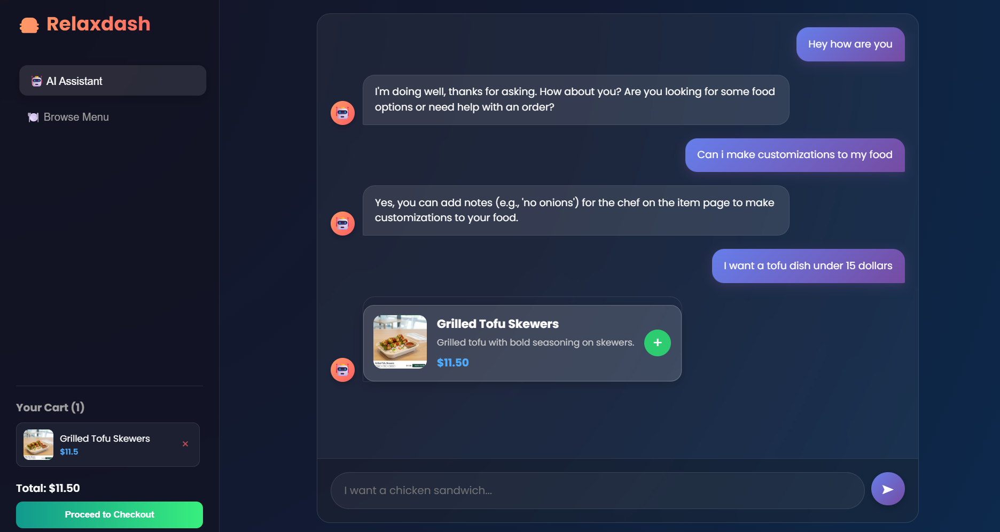

# RelaxDash - AI-Powered Food Delivery Platform

RelaxDash is an intelligent food delivery application that combines FastAPI backend with a React frontend, leveraging AI and semantic routing to provide an enhanced user experience.
## 🎬 Demo & Chat Examples

All three interactions showcased in a single conversation:



**Interaction 1: Initial Greeting**
- User sends a greeting message
- General chat route is triggered
- Groq LLM generates a friendly greeting response and asks about food preferences

**Interaction 2: Customization Question**
- User asks: "Can I customize my order?"
- **Semantic Router** classifies this as an FAQ route
- **ChromaDB** performs semantic search on FAQ dataset using RAG
- System retrieves relevant context and replies that customization is available

**Interaction 3: Product Search with SQL**
- User asks: "Show me tofu dishes under $15"
- **Semantic Router** classifies this as a SQL route
- **SQL Generation Module** converts natural language to SQL query
- **MySQL Database** executes the query and retrieves matching items
- Results are displayed with options to add to cart

## 📋 Table of Contents

- [Project Overview](#project-overview)
- [Features](#features)
- [Tech Stack](#tech-stack)
- [Project Structure](#project-structure)
- [Prerequisites](#prerequisites)
- [Installation](#installation)
- [Configuration](#configuration)
- [Running the Application](#running-the-application)
- [API Documentation](#api-documentation)
- [Project Components](#project-components)

## 🎯 Project Overview

RelaxDash is a full-stack web application designed to streamline food delivery operations. It uses AI-powered chatbots, semantic routing, and intelligent SQL query generation to provide users with:
- Real-time restaurant browsing
- AI-powered FAQ assistance
- Natural language search capabilities
- Order management
- Menu exploration

## ✨ Features

### Backend Features
- **FastAPI REST API** with CORS support for seamless frontend integration
- **Semantic Router** for intelligent request routing based on natural language understanding
- **FAQ Chatbot** using ChromaDB vector database for semantic search
- **SQL Query Generation** with AI-powered natural language to SQL conversion
- **Restaurant & Menu Management** with MySQL database integration
- **Chat Interface** with conversation history support

### Frontend Features
- **React-based UI** for responsive user experience
- **Component-based Architecture** with modular page components
- **Real-time API Integration** using Axios
- **Modern Styling** with CSS customization
- **Multiple Pages**: Browse, ChatBot, Checkout, Sidebar navigation

## 🛠️ Tech Stack

### Backend
- **Framework**: FastAPI
- **Server**: Uvicorn
- **Database**: MySQL
- **Vector Database**: ChromaDB
- **AI/LLM**: Groq API (llama-3.3-70b-versatile)
- **NLP**: Semantic Router, Sentence Transformers
- **Other**: Python-dotenv, Pandas

### Frontend
- **Framework**: React 19.2.3
- **HTTP Client**: Axios
- **Testing**: Jest, React Testing Library
- **Build Tool**: React Scripts 5.0.1

### Database
- **MySQL** for relational data
- **ChromaDB** for vector embeddings and semantic search

## 📁 Project Structure

```
RelaxDash/
├── BackEnd/                      # Python FastAPI backend
│   ├── main.py                   # FastAPI application entry point
│   ├── router.py                 # Semantic router configuration
│   ├── faq.py                    # FAQ chatbot with ChromaDB
│   ├── sql.py                    # AI-powered SQL query generation
│   ├── browse.py                 # Restaurant and menu fetching
│   ├── general.py                # General chat responses
│   ├── orders.py                 # Order management logic
│   ├── check_data.py             # Data validation utilities
│   ├── main_sub.py               # Subscription/additional features
│   ├── .env                      # Environment variables (API keys)
│   └── resources/                # Data files
│       ├── FAQ_Relaxdash.csv
│       ├── faq_data.csv
│       └── ecommerce_data_final.csv
├── frontend/                     # React frontend
│   ├── src/
│   │   ├── App.js                # Main app component
│   │   ├── App.css               # Global styles
│   │   ├── index.js              # React entry point
│   │   ├── pages/
│   │   │   ├── Browse.js         # Restaurant browse page
│   │   │   ├── ChatBot.js        # AI chatbot interface
│   │   │   ├── Checkout.js       # Order checkout
│   │   │   └── Sidebar.js        # Navigation sidebar
│   │   └── ...
│   ├── public/
│   │   ├── index.html
│   │   ├── manifest.json
│   │   ├── robots.txt
│   │   └── assets/
│   ├── package.json
│   └── README.md
└── Database/
    └── RelaxDB.sql               # Database schema
```

## 📦 Prerequisites

- **Python 3.8+** (for backend)
- **Node.js 14+** (for frontend)
- **MySQL 5.7+** (for database)
- **Groq API Key** (for AI features)

## 🚀 Installation

### Backend Setup

1. **Navigate to BackEnd directory**:
   ```bash
   cd RelaxDash/BackEnd
   ```

2. **Create a virtual environment** (recommended):
   ```bash
   python -m venv venv
   ```
   
   On Windows:
   ```bash
   venv\Scripts\activate
   ```
   
   On macOS/Linux:
   ```bash
   source venv/bin/activate
   ```

3. **Install Python dependencies**:
   ```bash
   pip install -r requirements.txt
   ```

### Frontend Setup

1. **Navigate to frontend directory**:
   ```bash
   cd RelaxDash/frontend
   ```

2. **Install Node dependencies**:
   ```bash
   npm install
   ```

### Database Setup

1. **Create MySQL database**:
   ```bash
   mysql -u root -p
   ```

2. **Import database schema**:
   ```sql
   source RelaxDash/Database/RelaxDB.sql;
   ```

3. **Update database credentials** in `BackEnd/browse.py` and `BackEnd/sql.py` if needed.

## ⚙️ Configuration

### Backend Environment Variables

Create or update `.env` file in `BackEnd/` directory:

```env
# Groq API Configuration
GROQ_API_KEY=your_groq_api_key_here
GROQ_MODEL=llama-3.3-70b-versatile

# Database Configuration (if needed)
DB_HOST=localhost
DB_USER=root
DB_PASSWORD=your_password
DB_NAME=relaxdash
```

**Note**: Replace `your_groq_api_key_here` with your actual Groq API key.

### Database Configuration

Update database credentials in:
- `BackEnd/browse.py`
- `BackEnd/sql.py`

```python
DB_CONFIG = {
    "host": "localhost",
    "user": "root",
    "password": "your_password",
    "database": "relaxdash"
}
```

## ▶️ Running the Application

### Option 1: Run Backend and Frontend Separately

**Terminal 1 - Start Backend API**:
```bash
cd RelaxDash/BackEnd
python -m uvicorn main:app --reload --port 8000
```

The API will be available at `http://localhost:8000`
- API Docs: `http://localhost:8000/docs`
- ReDoc: `http://localhost:8000/redoc`

**Terminal 2 - Start Frontend**:
```bash
cd RelaxDash/frontend
npm start
```

The frontend will open at `http://localhost:3000`

### Option 2: Run Both Simultaneously (using npm concurrently)

```bash
# From project root, if configured with concurrently
npm run dev
```

## 📚 API Documentation

### Base URL
```
http://localhost:8000
```

### Key Endpoints

#### Chat Endpoints
- **POST** `/chat` - Send a chat message
  - Request:
    ```json
    {
      "query": "What restaurants are nearby?",
      "history": []
    }
    ```
  - Response:
    ```json
    {
      "response": "...",
      "route_used": "faq|sql|general"
    }
    ```

#### Browse Endpoints
- **GET** `/restaurants` - Get all restaurants
- **GET** `/menu/{restaurant_id}` - Get menu for specific restaurant

### Interactive API Documentation
Visit `http://localhost:8000/docs` for Swagger UI documentation of all available endpoints.

## 🔧 Project Components

### Backend Modules

#### `main.py`
- FastAPI application setup
- CORS configuration
- Startup events for data ingestion
- Chat request/response models
- Main route handlers

#### `router.py`
- Semantic routing configuration
- Route definitions (FAQ, SQL, General)
- Utterance examples for each route
- Dynamic routing based on user input

#### `faq.py`
- ChromaDB vector database integration
- FAQ data ingestion from CSV
- Semantic search for FAQ responses
- Groq API integration for enhanced responses

#### `sql.py`
- AI-powered SQL query generation
- Natural language to SQL conversion
- Database query execution
- Result formatting for frontend

#### `browse.py`
- Restaurant data fetching
- Menu retrieval
- Database connections
- CRUD operations for restaurants and items

#### `general.py`
- General conversation handling
- Fallback responses
- Small talk processing

### Frontend Components

#### `App.js`
- Main application component
- Routing logic
- State management

#### `pages/Browse.js`
- Restaurant listing
- Menu browsing
- Filter and search functionality

#### `pages/ChatBot.js`
- Chat interface
- Message history
- Real-time responses from backend

#### `pages/Checkout.js`
- Order summary
- Payment processing
- Order confirmation

#### `pages/Sidebar.js`
- Navigation menu
- User options
- Quick links

## 🐛 Troubleshooting

### Backend Issues
- **Module not found**: Ensure all dependencies are installed via `pip install -r requirements.txt`
- **Database connection error**: Verify MySQL is running and credentials are correct
- **GROQ API error**: Check that API key is set in `.env` file

### Frontend Issues
- **Cannot reach API**: Ensure backend is running on port 8000
- **Module not found**: Run `npm install` again
- **Port 3000 already in use**: Kill the process or specify a different port


## 👥 Contributors

Rishi Senthil Kumar
Masters Student at North Carolina State University


